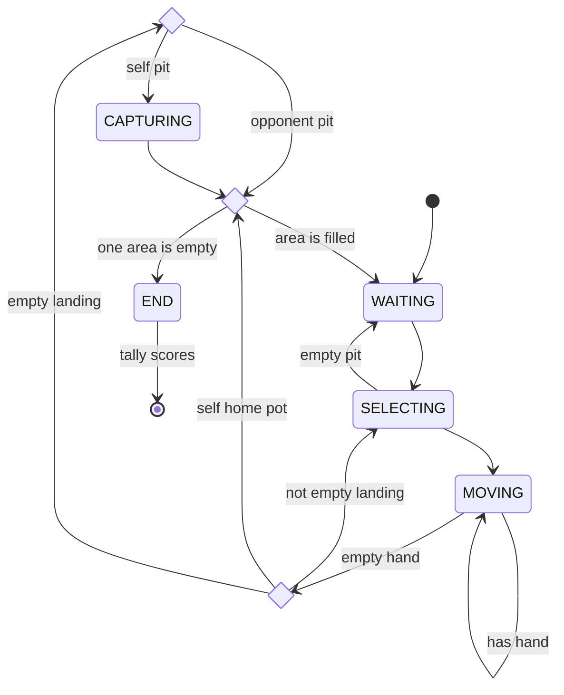
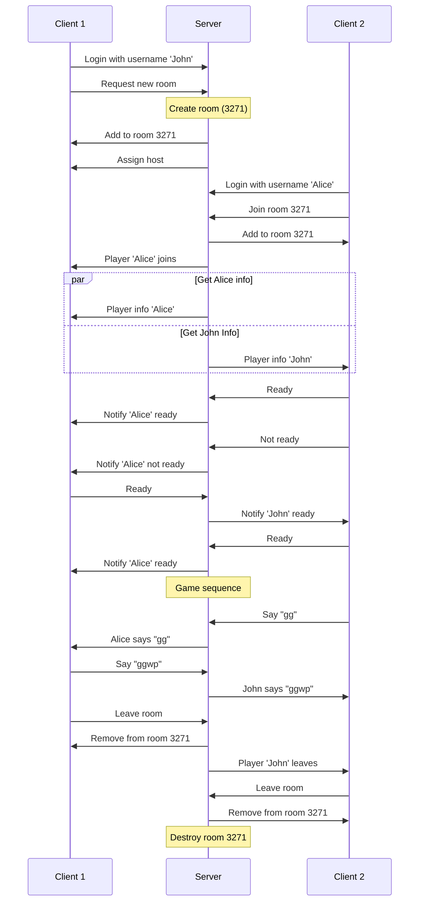
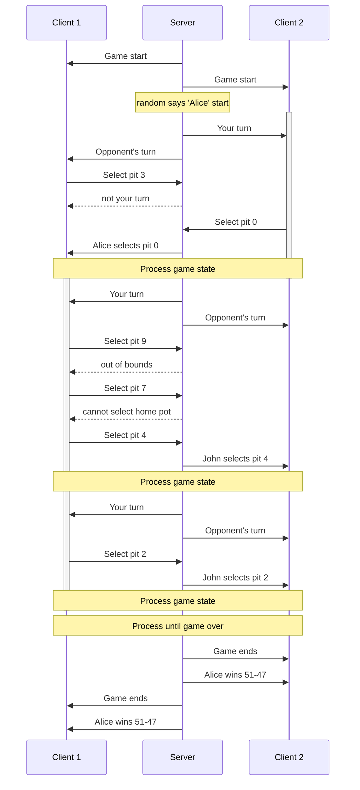
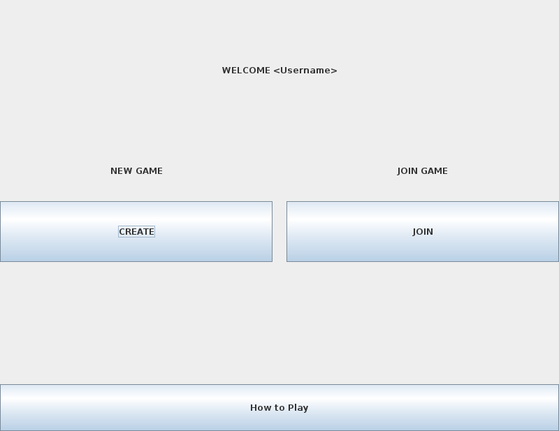
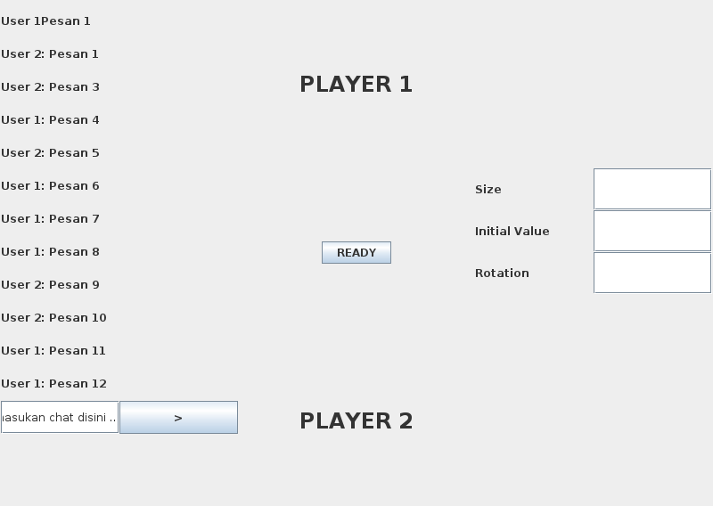
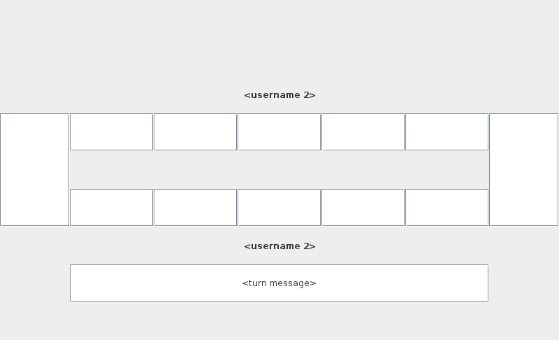
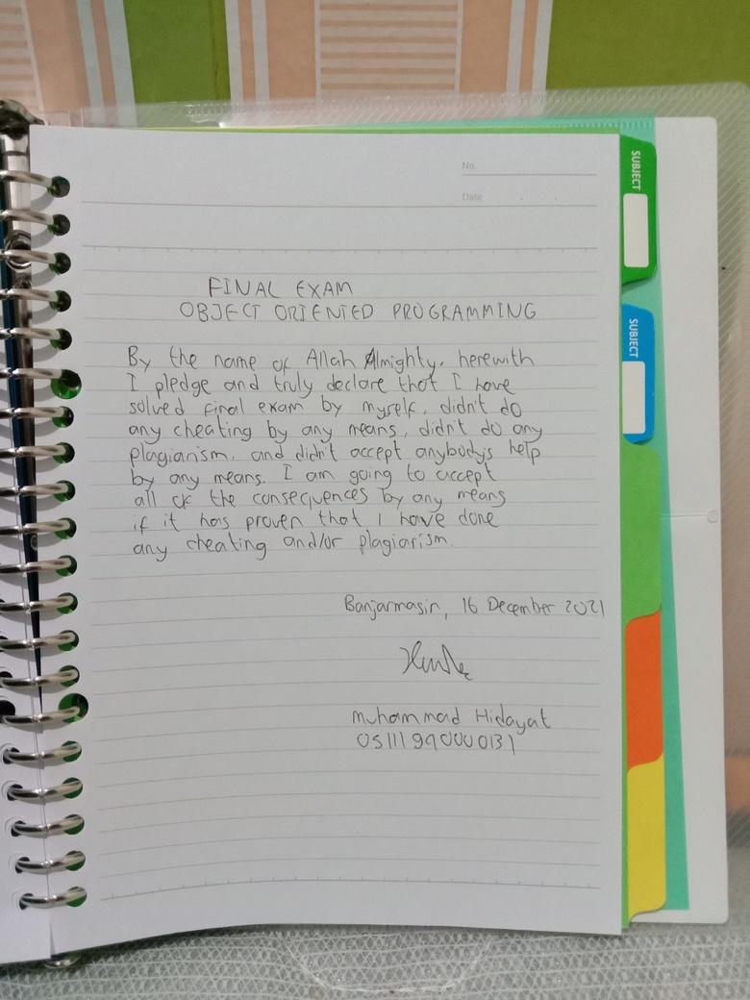
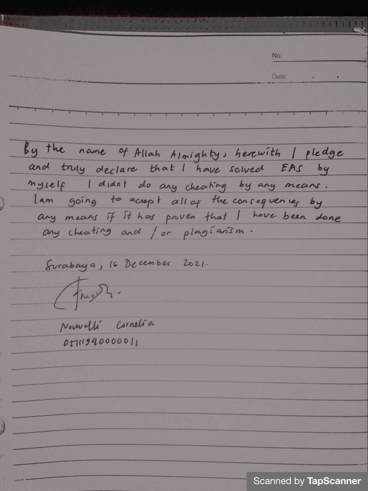

# Pebbles: Technical Documentation

Authors:
- Muhammad Hidayat "HD" (05111940000131)
- Nouvelli Cornelia "VL" (05111940000011)

The following document describes everything about the project and its individual parts that make the game possible. We will explain in detail from the core mechanics of the game to the client-server communication through sockets and their interfaces.

## Roadmap

- [x] Working core gameplay
- [x] Client-server connection
- [ ] Lobby functionality
- [ ] Chat system
- [ ] Implement chat into interface
- [ ] Implement game into interface

## Core gameplay

The game is based on the [Southeast Asian](https://en.m.wikipedia.org/wiki/Southeast_Asian_mancala) variant of mancala. In Indonesia, it is also known as _congklak_ or _dakon_ in Javanese.

### Description

There will be exactly two players that will play the game. A **player** is identified by their username. The username is stripped from any whitespace. A player also holds the following information:

- Play count: amount of times a player completes a game,
- Win count: amount of wins a player has,
- Win streak: amount of consecutive wins a player has achieved.

A completed game is defined as a game that has ended properly with a defined result for each player. The result can either be a win, lose, or draw. A completed game adds one to the play count. A **win** adds one to both win count and win streak. Meanwhile, a loss ("**lose**") does not add to win count and will reset the player's win streak to zero (0). On the other hand, a **draw** does not add to win count and does not change the win streak.

The game consists of a board with several holes. Each player has a specified amount of holes called **pits**. These pits will be filled with a set number of score units called **pebbles**, hence the name of the game. Each player also has one hole known as the **home pot** or the **store** that becomes the determining element of victory. In a standard game, each player has seven (7) pits and each pit is filled with 7 pebbles. It requires 98 pebbles to play the standard game.

### Rules

The player's score is determined by the amount of pebbles stored in the pot. Whoever has the highest score at the end of the game is the winner. However, if both players end with the same score, the game ends with a draw.

The gameplay is based on turns, alternating with each player. A turn goes by the following sequence of steps:

1. A player starts by selecting a pit and extracting all of its pebbles. One pebble is dropped into adjacent holes and moves on to the next in a circular motion, skipping opponent's home pot.

   > The direction of motion can be determined either clockwise or counterclockwise by convention. For simplicity sake, we assume that the motion is counterclockwise. This assumption is taken based on the facing position of the player and the visual order of the pits.

   How the game proceeds depends on where the last pebble is dropped.

2. If it ends on the player's home pot, they get another turn, starting over from step 1.
3. If it drops into a non-empty pit, then the player continues their turn by extracting from that pit and distributes it as described on step 1.
4. If it drops into an empty pit that belongs to the player, the player collects all the pebbles from the opponent's pit directly opposite their own. Together with their last pebble, the pebbles are then stored into the player's home pot. If the opponent's pit opposite their own is empty, then only the player's last pebble is stored into the pot. The player's turn ends and the game continues with the next player taking the turn.
5. If it drops into an empty pit that belongs to the opponent, the player's turn ends, leaving the last pebble on the opponent's side. The game continues with the next player taking the turn.

The game ends when a player has no more pebbles in their pits. All the remaining pebbles on the opponent's side belongs to them and stored in their pot.



### Implementation

A player's pits can be defined as an array that has `n+1` elements, where `n` is the number of pits a player can play, and `1` for the player's home pot that is positioned at the end of the array. In the case of two players, there will be two arrays with a total size of `2*n+2`. For memory efficiency, these two arrays can be combined into one array known as "game pits".

For easier access, these information are handily stored as properties:
- `pits` is an array that holds the game pits
- `pitCount = n` holds the number of playable pits for a player (not including home pot)
- `playerPitCount = pitCount + 1` holds the number of pits for a player (including home pot)
- `totalPitCount = 2 * playerPitCount` holds the total amount of pits in the game, effectively the same as the length of the array `pits`

Using the assumption of a standard game, the game pits at the start of a game can be visualized as follows:

```
idx     |  0 |  1 |  2 |  3 |  4 |  5 |  6 |  7  
player  |  1 |  1 |  1 |  1 |  1 |  1 |  1 |  1
pit/pot |  i |  i |  i |  i |  i |  i |  i |  o
content |  7 |  7 |  7 |  7 |  7 |  7 |  7 |  0

idx     |  8 |  9 | 10 | 11 | 12 | 13 | 14 | 15  
player  |  2 |  2 |  2 |  2 |  2 |  2 |  2 |  2
pit/pot |  i |  i |  i |  i |  i |  i |  i |  o
content |  7 |  7 |  7 |  7 |  7 |  7 |  7 |  0
```

However, in the real life version of the game, it is visualized differently. Depending on convention, this game can either be played clockwise or counterclockwise with the rotation center being the center of the board. If the game is played clockwise, then the player's home pot is positioned on the left side of the player's facing view. Here is an approximation of how the game looks:

```
                      Player 2

         |  7 |  7 |  7 |  7 |  7 |  7 |  7 | (P2 pot)
      0 -+----+----+----+----+----+----+----+- 0
(P1 pot) |  7 |  7 |  7 |  7 |  7 |  7 |  7 |  

                      Player 1
```

The game must be able to access each individual entries, either from the player's perspective or from the game's global pit index. Therefore, there must be a utility to convert between global index to player's index.

To get the global index from the player's scope, a function takes the player's pit index and their order of play.

```python
def getGlobalPos(isPlayerTwo, playerIndex):
    if isPlayerTwo:
        playerIndex + playerPitCount
    else:
        playerPitCount
```

To get the pit index directly opposite to the player with respect to the global index, the following function can be used.

```py
def getCrossPos(globalIndex):
    (2 * playerPitCount) - globalIndex
```

## Server-Client Communication

- Server waits for connection
- Client connects, server confirms
- Client writes client commands and reads server commands
- Server writes server commands and reads client commands

Client commands:
- `/us <username>` Set username, cannot be changed afterwards
- `/lc` lobby create room
- `/lj <lobbyID>` lobby join room with ID
- `/rc <message...>` room chat
- `/rr <+|->` room ready or not
- `/rl` leave room
- `/gp <pitIndex>` game select pit at `pitIndex` 

Server commands:
- `/us <+|-> <username>` Set username, `-` if not possible (username taken or something else)
- `/ui <+|-> <username> <pc> <wc> <ws>` send username info (and play count/win count/win streak if `+`)
- `/li <+|-> <lobbyId>` send assigned lobby, results `-` if room not available or full
- `/rc <username> <message...>` player room chat
- `/rj <username>` player joins room
- `/rl <username>` player leaves room
- `/rr <+|-> <username>` player ready
- `/gs <pitCount> <initValue>` game start with given settings
- `/gt <username>` game turn, player do a turn
- `/gp <+|> <username> <pitIndex>` player selects, `+` if valid
- `/ge` game end
- `/gw <username> <winscore> <losescore>` announce game winner and the scores  



Game sequence diagram



## Graphical User Interface (GUI) for Client

Due to time constraint, we were unable to create a fully functional user interface. What we have made are the rough layout structure of the game.

Login screen:


Main menu:



Lobby (with chat):



Gameplay screen:



## Appendix A: Declarations





## Appendix B: Contributions

Task | Contributor | Rate
-----|-------------|------
Core gameplay mechanic | HD | 20
Client connection | HD | 25
Server socket | HD | 25
User interface | VL | 20
Documentation | HD | 10

Total contribution rates:
- HD: 80%
- VL: 20%